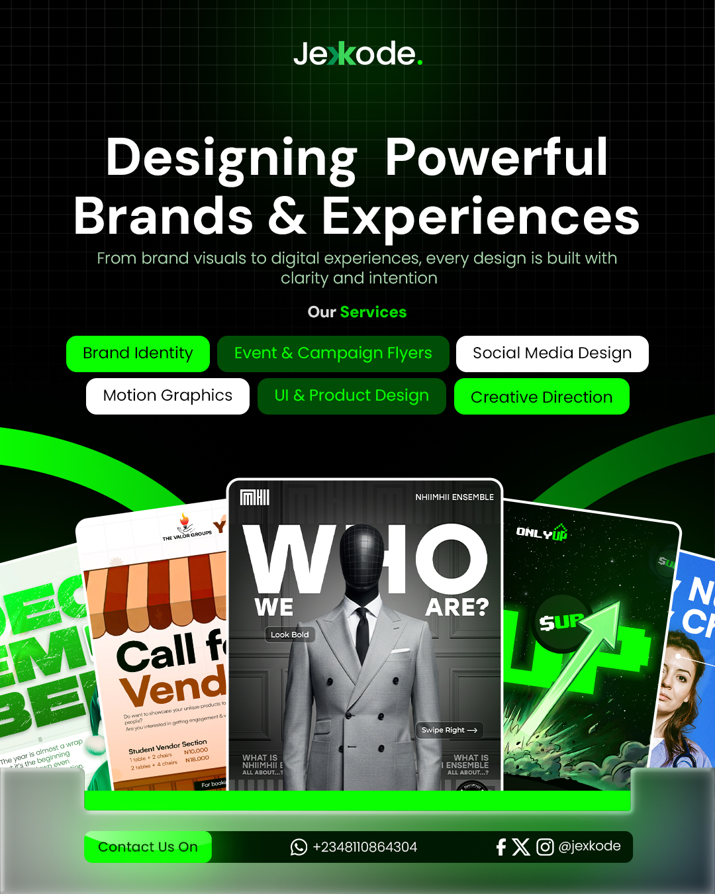

# Jexkode — Creative Brand Showcase

A modern creative studio showcase built with pure HTML and CSS.

This project represents my growth journey in frontend development and visual design — translating a complete brand concept into a functional web interface without using frameworks or external UI libraries.

## Overview

Jexkode is a creative design brand focused on:
- Brand Identity
- Social Media Design
- UI & Product Design
- Motion Graphics
- Creative Direction

This project was designed and developed to explore how strong visual identity can be combined with clean frontend structure and responsive layouts.

## Purpose of the Project

The goal of this project was to:
- Recreate a professional creative studio visual in code
- Improve my understanding of HTML & CSS fundamentals
- Practice layout structure and spacing systems
- Experiment with typography, glow effects, and visual hierarchy
- Build confidence in frontend implementation without frameworks

## Built With

- HTML5
- CSS3

No frameworks or libraries were used.

## Features

- Modern agency-inspired layout
- Responsive structure
- Custom glow effects
- Typography-focused hierarchy
- Portfolio showcase section
- Clean service display components
- Minimal and futuristic visual direction

## Design Direction

The visual identity focuses on:
- Black and neon green aesthetics
- Clean geometric spacing
- Bold typography
- Creative studio energy
- Modern digital branding

## What I Learned

- CSS positioning and layout systems
- Flexbox structuring
- Visual hierarchy and spacing consistency
- Responsive design thinking
- Translating UI concepts into code

## Future Improvements

- Add animations and transitions
- Improve mobile responsiveness
- Convert sections into reusable components
- Add JavaScript interactivity
- Expand into a full portfolio website

## Preview

Here is the final design output of the project:

## Author

Designed and developed by Jexkode.- Bold typography
- Creative studio energy
- Modern digital branding

The overall direction was inspired by modern creative agencies, tech startups, and futuristic design systems.

## What I Learned

Through this project, I improved my understanding of:
- CSS positioning
- Flexbox and layout control
- Spacing consistency
- Visual hierarchy
- Responsive design thinking
- Branding implementation in code
- Translating static designs into frontend interfaces

## Future Improvements

Planned improvements include:
- Adding animations and transitions
- Improving responsiveness across devices
- Converting sections into reusable components
- Adding JavaScript interactions
- Building a full portfolio/agency website from this concept

## Author

Designed and developed by Jexkode.

## Preview

> A creative studio showcase built as part of my journey in design and frontend development.
